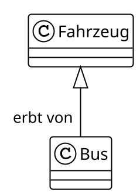
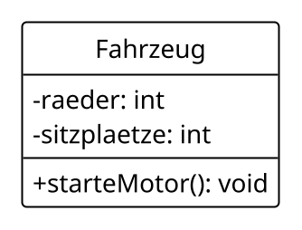
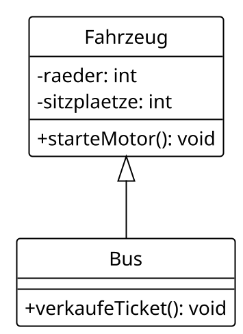
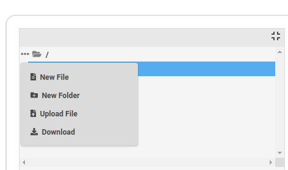
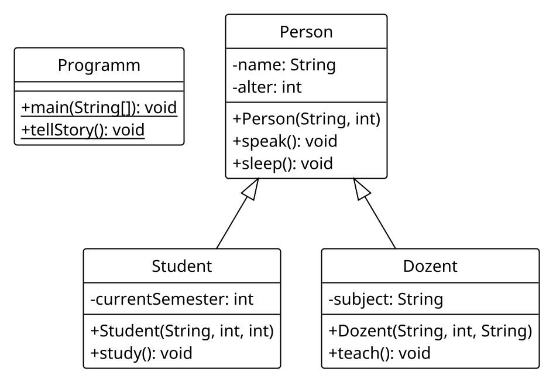

<style>
    .reveal {
        font-size: 30px !important;
    }
    .reveal code.hljs {
        background-color: #0a0a0a !important;
        border: 1px solid white;
    }
</style>

# Während Ihr darauf wartet, dass es beginnt..
- überprüfen wir Euren 3G-Status
- könnt ihr nochmal die Folien aus der letzten Stunde anschauen
    - hier verlinkt: https://trivo25.github.io/tud-java-course/
- VS Code oder https://www.jdoodle.com/online-java-compiler/ öffnen
- die Cheat Sheet öffnen: http://tiny.cc/java-cs

---

# Java
## Objektorientierte Programmierung

Florian Kluge, Moritz Schulz

02. Dezember 2021

<br>

Florian.Kluge@mailbox.tu-dresden.de

Moritz.Schulz2@mailbox.tu-dresden.de

---

## Was wir heute machen

**Objektorientierte Programmierung: Vererbung**

1. static
2. Vererbung
3. Visualisierung von Klassen (UML)

---

### Contact

Florian Kluge

Florian.Kluge@mailbox.tu-dresden.de


Moritz Schulz

Moritz.Schulz2@mailbox.tu-dresden.de

---

## Kurze Info zum Kurs

- bitte abmelden / entschuldigen, wenn ihr nicht kommt
    - zwei Mal in Folge unentschuldigt fehlen => ausgetragen 
- praktische Aufgaben- und Beispiel-basierte Lernweise
    - wir laufen herum und gucken, dass ihr zurecht kommt
- bitte, fragt gern, jederzeit
    - auch per E-Mail / via Kursseite
- uns geht es darum, alle mitzunehmen

---

## Stay up to date

- die E-Mails der TUD regelmäßig überprüfen
    - z.B. Bekanntgabe der Veröffentlichung der Folien
        - auf der Seite des Programmierkurses

---

# Los geht's!

---

# 20min für das Problem vom letzten Mal

- Aufgabe weiterbearbeiten, falls noch nicht fertig
- andere Aufgabe anfangen, falls noch nicht begonnen
- sinnvoll erweitern, falls beide "fertig"

---

##### Bankkonto - mittel - Teil 1

- schreibt eine Klasse `Bankkonto` welches folgende Attribute hat
    - String: kontoInhaber - Name Kontoinhaber*in
    - float: maxiUeberzug - Maximum welcher Betrag das Konto überzogen werden kann('im Minus')
    - String: iban - IBAN/Kontoaddresse
    - int: anzahlTransaktionen
    - float: guthaben - Guthaben

---

##### Bankkonto - mittel - Teil 2

- erweitert die Klasse `Bankkonto` um folgende Methoden (Parameter ausgelassen):
    - boolean: sendMoney() - schickt einen Betrag an ein anderes Konto und passt das Guthaben an, gibt false oder true zurück wenn es erfolgreich war oder nicht
    - void: payIn() - zahlt Geld in das Konto ein
    - boolean: withdraw() - hebt Geld von dem Konto ab, gibt false oder true zurück wenn es erfolgreich war oder nicht


---

##### Pokémon - schwer - Teil 1

- Schreibt ein Pokémon-Spiel in dem sich zwei Pokemons gegenseitig attackieren!
- Pokémons kämpfen (hier) gegeneinander, indem sie sich gegenseitig Lebenspunkte abziehen
- Nutzt dafür eine Klasse `Pokemon` mit folgenden Attributen:
    - String: name - Name des Pokémons
    - private float: health - Lebenspunkte des Pokémons
    - private float: attackPower - Angriffspunkte des Pokémons
    - private boolean: isDead - boolean ob Pokémon am Leben ist oder nicht

---

##### Pokémon - schwer - Teil 2

- Die Klasse `Pokemon` soll folgende Methoden haben (Parameter ausgelassen):
    - boolean: getIsDead() - gibt true oder false zurück wenn Pokémon lebt bzw. wenn nicht
    - void: attack() - nimmt ein Pokémon-Objekt als Methoden-Parameter und greift es an, fügt im attackPower Schaden zu!
    - void: dealDamage() - zieht Leben des Pokémons ab

---

# Das Keyword `static`

Wenn Funktionen und Variablen

zu keinem bestimmen Objekt gehören,

sondern zur Klasse

---

#### Was heißt eigentlich `static`?

- z.B. in der Funktion `public static void main(String[] args)`
- Alles, was `static` ist, gehört zu einer Klasse und zu keinem bestimmten Objekt
- Beispiel:
    - Funktionen sind `static`, Methoden sind nicht `static`

⇒ um auf `static` Funktionen zuzugreifen braucht man _kein_ Objekt

---

#### Wofür ist `static` gut?

- wir können beispielsweise Funktionen in einer Klasse gruppieren
- (`static`) Funktionen lassen sich ohne Objekt aufrufen
- (`static`) Funktionen haben aber keinen Zugriff auf Attribute vom Objekt der Klasse
    - denn es ist ihr kein Objekt bekannt

- Gegensatz: Methoden (**ohne** `static`) gehören **immer** zu einem Objekt einer Klasse!
    - können nur aufgerufen werden, wenn eine Instanz der Klasse (ein Objekt) vorliegt

---

#### Beispiel für static

```java
public class Programm {
    public static void main(String[] args) {
        Quadrat luca = new Quadrat(10.0f);
        float flaeche = luca.flaeche();
        float flaeche2 = Quadrat.berechneFlaeche(5.0f);
    }
}

class Quadrat {
    public float seitenlaenge;
    
    public Quadrat(float a){
        seitenlaenge = a;
    }

    public float flaeche() {
        return berechneFlaeche(seitenlaenge);    
    }
    
    public static float berechneFlaeche(float f) {
        // kennt seitenlaenge nicht!
        return f * f;    
    }
}
```

---

#### Anwendung von Funktionen

Funktionen (mit `static`) kennen also nur
- ihre Parameter
- übergeordnete `static` Variablen

Das heißt, sie brauchen kein zusätzliches Wissen.

Anwendung:
- so haben wir zu Beginn Funktionalität ausgelagert
- z.B. sqrt (Quadratwurzel) _braucht_ nichts außer der Zahl zu wissen

```java
import java.lang.Math;

class Programm {
    public static void main(String args[]) {
        System.out.println(Math.sqrt(30.0));
    }
}
```

---

auch Variablen einer Klasse können `static` sein

```java
public class Apokalypse {
    public static void main(String[] args) {
        Zombie zombie1 = new Zombie();
        Zombie zombie2 = new Zombie();
        Zombie zombie3 = new Zombie();
        Zombie zombie4 = new Zombie();
        Zombie zombie5 = new Zombie();
        
        System.out.println("Es gibt " + Zombie.anzahl + " Zombies!");
    }
}

class Zombie {
    public static int anzahl = 0;
    
    public Zombie(){
        anzahl++;
    }

    public void laufe() {
        System.out.println("*hink*");
    }
}
```

---

## Vererbung

- es gibt Objekte, die einander ähnlich sind
- Beispiele:
    - Auto, LKW, Bus -> alles Fahrzeuge
    - Kuh, Schaf, Schwein -> alles Tiere
    - Rechteck, Kreis, Dreieck -> alles geometrische Formen

---

#### Vererbung

- sie haben Gemeinsamkeiten
- diese Gemeinsamkeiten können wir bestimmen auf:
    - gemeinsame Eigenschaften (Attribute)
    - gemeinsames Verhalten (Methoden)

---

#### Vererbung

- wir können eine Klasse bilden, die nur diese Gemeinsamkeiten enthält
    - sie nennen wir `superclass` (übergeordnete Klasse)
- aus dieser Klasse können wir `subclasses` (untergeordnete Klassen) ableiten
    - sie übernehmen alle Attribute und Methoden der `superclass`
        - dieses "Übernehmen" heißt Vererbung
- Beispiel: ("->" heißt: "erben von"), alles sind Klassen
    - `subclasses` Auto, LKW, Bus -> `superclass` Kraftfahrzeug
    - `subclasses` Kuh, Schaf, Schwein -> `superclass` Tier

---

#### Vererbung - Beispiel

- PKW, Bus, LKW -> Fahrzeug
  - ein PKW erbt alle Attribute und Methoden der Klasse Fahrzeug

... aber wie sieht das in Java aus?

---

#### Vererbung - Beispiel

- Klasse `Fahrzeug`, so wie wir es bis jetzt immer gemacht haben

```java
class Fahrzeug {
    public int raeder;
    public int sitzplaetze;
    // ..
    public void starteMotor() {
        System.out.println("Motor läuft!")
    }
}

```

---

#### Vererbung - Beispiel

- Klasse `Bus` - ist ein Fahrzeug, hat aber besondere Eigenschaften
    - Vererbung mit `extends` signalisiert

```java
class Bus extends Fahrzeug {
    /*
    Hier sind jetzt alle Methoden und Attribut 
    aus der Klasse Fahrzeug verfügbar!
    */
    
    // unsere "besondere" Methode welche nur ein Bus hat
    public void verkaufeTicket() {}
}

```

---

#### Vererbung - Beispiel

- `Bus` hat nun automatisch alle Methoden und Attribute von der Klasse `Fahrzeuge`
- zusätzlich gibt es für jedes Objekt der Klasse `Bus`
    - alle "besonderen" Methoden/Attribute
        - wie beispielsweise `void sellTicket()`

```java

Bus b1 = new Bus();
// Attribute und Methoden aus Klasse Fahrzeug
b1.raeder = 4;
b1.sitzplaetze = 40;
b1.starteMotor();

// Methode aus Klasse Bus
b1.verkaufeTicket();

```

---

#### Visualisierung

- Vererbung von Klassen lässt sich visuell darstellen
    - meist mit einem UML (Unified Modeling Language) Diagramm
    - wichtig für die weiterführenden Semester!
- UML Diagramme stellen visuell den Zusammenhang von Klassen, Paketen, ... dar

---

#### UML - Beispiel Fahrzeug/Bus

Bus _erbt_ von Fahrzeug <br>



---

#### UML - Beispiel Fahrzeug/Bus

- wir können ebenfalls Methoden und Attribute im Diagramm darstellen


```java
class Fahrzeug {
    public int raeder;
    public int sitzplaetze;
    // ..
    public void starteMotor() {
        System.out.println("Motor läuft!")
    }
}

```


---

#### UML - Beispiel Fahrzeug/Bus

- Attribute (Variablen) im Format:
    - `-variableName: Datentyp`

- Methoden im Format:
    - `+methodenName(Parameter): Datentyp`




---

#### UML - Beispiel Fahrzeug/Bus

- Vollständiges Klassendiagramm von Fahrzeug <- Bus



---

#### Vererbung - Bemerkungen und Zusammenfassung

- Klassen können von anderen erben
    - dafür nutzen wir das `extends` Keyword
- Klassen können somit Attribute und Methoden einer Oberklasse erben
    - dann übernehmen Objekte einer Klasse auch Attribute und Methoden der Oberklasse(n)
- Wann macht das Sinn? Wenn die Oberklasse viele Merkmale mehrere Unterklassen verbindet
    - Beispiel:
        - Hund, Katze, Vogel -> alles Tiere
        - PKW, LKW, Bus -> alles Fahrzeuge
        - ...
- mehrere Klassen können von einer Oberklasse mit `Unterklasse extends Oberklasse` erben
    - wir können aber nur von einer Oberklasse erben!

---

#### Vererbung - Bemerkungen und Zusammenfassung

- Vererbung kann sich theoretisch unendlich lang weiterziehen..
    - Beispiel:
        - Oberklasse: **Tier**
        - **Wolf** erbt von **Tier**
        - **Hund** erbt von **Wolf**
        - **Haushund** erbt von **Hund**
        - **Schäferhund** erbt von **Haushund**
        - ....
- Klassen können mehrere Oberklassen haben
    - jede Klasse hat automatisch die Oberklasse `Object`
        - später mehr zu den Eigenschaften, die das mit sich bringt
    - Beispiel:
        - **Kugel** erbt von **3DKörper**, **RollendesObjekt**, **Object**

---

#### Vererbung - Bemerkungen und Zusammenfassung

- Was ist der Sinn hinter (mehrfach) Vererbungen?
    - Oberklassen sind **allgemein / generalisiert**
    - Unterklassen werden immer **spezialisierter**
- Oberklassen beschreiben grobe Zusammenhänge
    - und Unterklassen spezialisieren diese

---

## mit mehreren Dateien arbeiten

- denn eine Klasse pro Datei ist üblich

- online

https://www.jdoodle.com/online-java-compiler-ide/



---

- VS Code
    - mehrere Dateien
    - Empfehlung: neuer Ordner `Ordner`
    - im Terminal:
        - `cd Ordner` # wechselt in den Ordner
        - `javac Datei1.java Datei2.java`
        - `java Datei1` # die Datei, die `main` enthält

---

#### Vererbung und UML - Aufgabe

- folgendes UML-Diagramm beschreibt folgenden Zusammenhang:
    - Oberklasse: Person
        - eine Person hat verschiedene Attribute und Methoden
    - Unterklasse 1: Student erbt von Person
        - ein Student hat **spezialisierte** Methoden und Attribute
    - Unterklasse 2: Dozent erbt von Person
        - ein Dozent hat wiederum ebenfalls **spezialisierte** Methoden und Attribute

---

#### Vererbung und UML - Aufgabe

- Entwickle die Klassen und definiere die entsprechenden Attribute, Methoden und Konstruktoren.
- Die Methoden geben jeweils Text aus, der sie beschreibt
- Die Funktion `tellStory()` in der Klasse `Programm` soll den Tagesverlauf eines Studenten beschreiben
    - dazu soll sie entsprechende Objekte verwenden

---

#### Vererbung und UML - Aufgabe




---

## Nächste Stunde

- meeeehr OOP

---

## Tipp: Advent of Code

https://adventofcode.com/2021

---

## Links, Contact Info, Feedback

See course materials here:
https://trivo25.github.io/tud-java-course/

Check out the Cheat Sheet:
http://tiny.cc/java-cs
